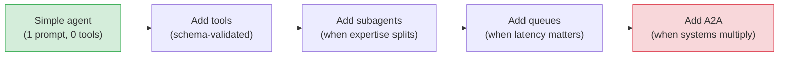

This guide covers the engineering patterns for building production-quality AI features with AFK. It's organized around three phases: starting narrow, adding capabilities, and scaling safely.

## Start narrow, iterate fast

The most common mistake is building for complexity you don't have yet. Start with the simplest version that solves the problem, then add capabilities based on real evidence.



> [!TIP]
> **Test at every step.** Don't add tools before the base prompt works. Don't add subagents before single-agent tools work. Each layer should be proven before adding the next.

## Common patterns

<Tabs>
  <Tab title="Classifier agent">
    Categorize input into predefined labels. No tools needed.

    ```python
    agent = Agent(
        name="classifier",
        model="gpt-5.2-mini",
        instructions="""
        Classify the support ticket into exactly one category:
        billing, technical, account, feature-request, other.
        Output only the category name, nothing else.
        """,
    )
    ```

    **Tips:**
    - Constrain output format explicitly in the prompt
    - Test with a diverse set of inputs
    - Add evals for each category

  </Tab>
  <Tab title="RAG agent">
    Retrieve context, then generate an answer.

    ```python
    @tool(args_model=SearchArgs, name="search_docs", description="Search the knowledge base.")
    def search_docs(args: SearchArgs) -> dict:
        results = vector_db.search(args.query, top_k=5)
        return {"results": [r.text for r in results]}

    agent = Agent(
        name="rag-agent",
        model="gpt-5.2-mini",
        instructions="""
        Always search the knowledge base before answering.
        Cite sources. If no relevant docs found, say so.
        """,
        tools=[search_docs],
    )
    ```

    **Tips:**
    - Always search before answering
    - Instruct the model to cite sources
    - Set `tool_output_max_chars` to prevent context overflow

  </Tab>
  <Tab title="Coding agent">
    Generate, review, and test code.

    ```python
    @tool(args_model=TestArgs, name="run_tests", description="Run the test suite.")
    def run_tests(args: TestArgs) -> dict:
        result = subprocess.run(["pytest", args.test_path], capture_output=True)
        return {"exit_code": result.returncode, "output": result.stdout[:4000]}

    agent = Agent(
        name="coder",
        model="gpt-5.2",
        instructions="""
        Write code, then run the tests to verify.
        Fix any failures before presenting the final version.
        """,
        tools=[read_file, write_file, run_tests],
        fail_safe=FailSafeConfig(
            max_steps=20,
            max_tool_calls=15,
            max_total_cost_usd=1.00,
        ),
    )
    ```

    **Tips:**
    - Higher cost limits (coding agents iterate more)
    - Gate `write_file` with policy approval
    - Use sandbox profiles for code execution

  </Tab>
  <Tab title="Coordinator pattern">
    Route tasks to specialist subagents.

    ```python
    coordinator = Agent(
        name="coordinator",
        model="gpt-5.2-mini",
        instructions="""
        Route each request to the appropriate specialist:
        - Technical questions → 'engineer'
        - Billing questions → 'billing-agent'
        - Everything else → answer directly
        """,
        subagents=[engineer, billing_agent],
    )
    ```

    **Tips:**
    - Keep the coordinator's prompt focused on routing
    - Don't give the coordinator tools — let specialists handle execution
    - Use `join_policy="allow_optional_failures"` if some specialists are non-critical

  </Tab>
</Tabs>

## Anti-patterns

<Warning>
  These are the most common mistakes. Avoiding them will save you significant
  debugging time.
</Warning>

| Anti-pattern                           | Problem                                              | Fix                                                |
| -------------------------------------- | ---------------------------------------------------- | -------------------------------------------------- |
| **No cost limits**                     | Runaway agent loops spend $100s in minutes           | Always set `max_total_cost_usd`                    |
| **Vague instructions**                 | Model produces inconsistent output                   | Be specific: "Output only the category name"       |
| **Too many tools**                     | Model gets confused choosing between tools           | Keep ≤ 5 tools per agent. Split into subagents.    |
| **Mixing orchestration and execution** | Runner logic leaks into tool handlers                | Tools should be pure functions. No runner imports. |
| **Skipping evals**                     | Prompt changes break behavior silently               | Run evals in CI on every PR                        |
| **Untyped tool arguments**             | Missing validation, hard-to-debug errors             | Always use Pydantic models                         |
| **Not classifying failures**           | Retryable errors treated as terminal (or vice versa) | Return clear error types from tools                |
| **Giant system prompts**               | Token waste, instruction drift                       | Split into skills. Use templates.                  |

## Production readiness checklist

| Area              | Requirement                                       | Status                                    |
| ----------------- | ------------------------------------------------- | ----------------------------------------- |
| **Safety**        | `FailSafeConfig` with cost, step, and time limits | <Icon icon="square" iconType="regular" /> |
| **Safety**        | Policy rules for all mutating tools               | <Icon icon="square" iconType="regular" /> |
| **Observability** | Telemetry exporter configured (OTEL recommended)  | <Icon icon="square" iconType="regular" /> |
| **Observability** | Alerts on error rate and latency                  | <Icon icon="square" iconType="regular" /> |
| **Testing**       | Eval suite with ≥ 5 cases running in CI           | <Icon icon="square" iconType="regular" /> |
| **Testing**       | Golden traces captured for regression detection   | <Icon icon="square" iconType="regular" /> |
| **Memory**        | Persistent backend for multi-turn conversations   | <Icon icon="square" iconType="regular" /> |
| **Memory**        | Thread compaction configured                      | <Icon icon="square" iconType="regular" /> |
| **Security**      | Secrets in environment variables, not code        | <Icon icon="square" iconType="regular" /> |
| **Security**      | Sandbox profiles for code execution tools         | <Icon icon="square" iconType="regular" /> |

## Next steps

<CardGroup cols={2}>
  <Card title="Observability" icon="chart-bar" href="/library/observability">
    Set up monitoring, alerting, and dashboards.
  </Card>
  <Card title="Evals" icon="check-circle" href="/library/evals">
    Write behavioral tests for agents.
  </Card>
</CardGroup>
